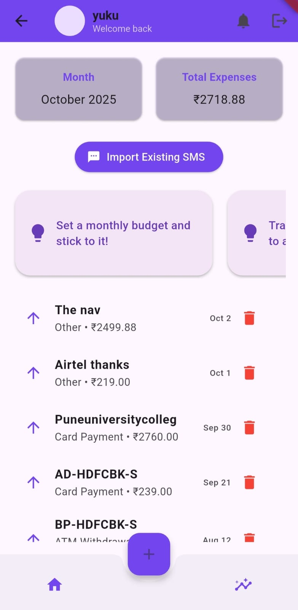
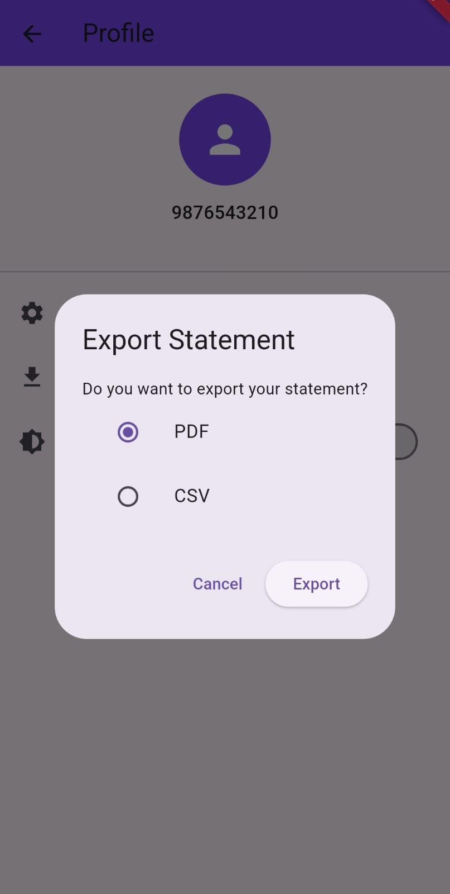
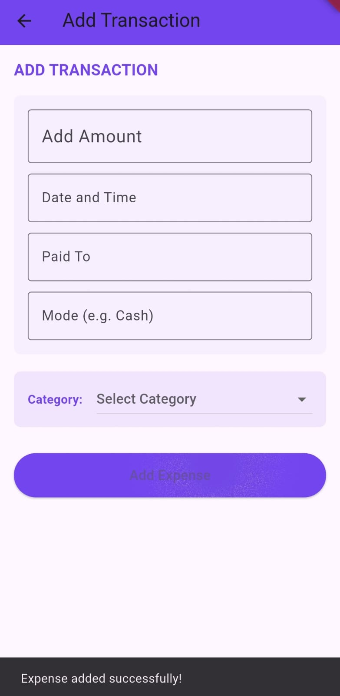
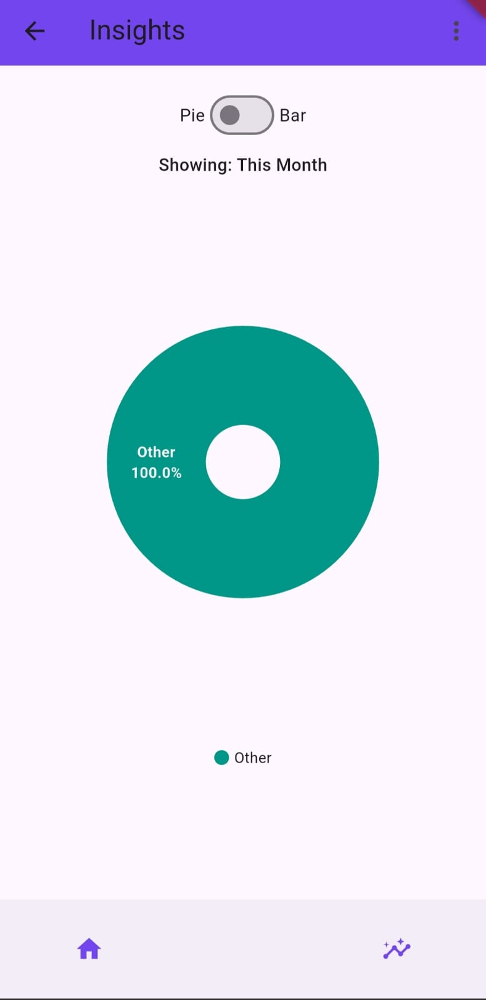
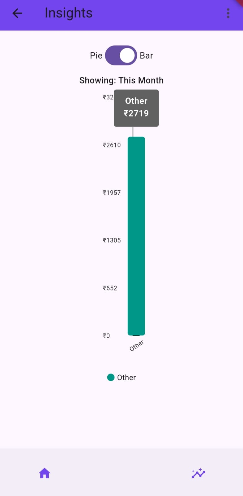

Spendo 💸

Spendo is a modern, easy-to-use expense tracker app built with Flutter. It helps users manage their finances, track daily expenses, and analyze spending patterns in a simple and intuitive interface.

Features

•	**Add & Track Expenses:** Quickly add your daily expenses with categories and notes.

•	**Expense Categories:** Organize your expenses into categories like Food, Transport, Shopping, etc.

•	**Dashboard & Analytics:** View monthly and weekly spending summaries with charts.

•	**User-Friendly Interface:** Clean, minimalistic, and intuitive design for easy navigation.

•	**Data Persistence:** Store expenses locally using SQLite or Firebase (depending on your setup).

## My App Screenshots 📱

Dashboard | Export | Add | Insights  
--- | --- | --- | --- 
 | 
 | 
 | 

  
  

**Getting Started**

These instructions will help you set up and run the project on your local machine.

_Prerequisites_

•	Flutter SDK: https://docs.flutter.dev/get-started/install

•	Dart: Comes with Flutter

•	An IDE such as VS Code or Android Studio

Installation

1.	Clone the repository:
   
git clone https://github.com/yourusername/spendo.git

2.	Navigate to the project folder:
   
cd spendo

3.	Install dependencies:
   
flutter pub get

4.	Run the app:

flutter run
________________________________________
Tech Stack

•	Frontend: Flutter & Dart

•	Database: SQLite / Firebase (for cloud sync, optional)

•	State Management: Provider / Riverpod / GetX (depending on your setup)
________________________________________
Contributing

Contributions are welcome! If you find a bug or want to propose a feature, feel free to open an issue or submit a pull request.

